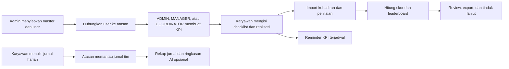
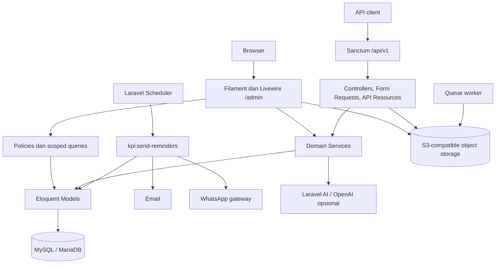

<p align="center">
  
</p>

<h1 align="center">DnD Web</h1>

<p align="center">
  Aplikasi internal untuk mengelola struktur karyawan, KPI bulanan, aktivitas kerja,
  kehadiran, penilaian, jurnal harian, approval, leaderboard, dan reminder.
</p>

DnD menyediakan dua jalur penggunaan:

- **Admin panel Filament** di `/admin` untuk operasional berbasis web.
- **REST API v1** di `/api/v1` untuk integrasi dengan aplikasi lain.

Bahasa utama aplikasi adalah Bahasa Indonesia dan seluruh perhitungan waktu menggunakan zona waktu `Asia/Jakarta`.

> [!IMPORTANT]
> DnD adalah aplikasi internal. API memakai autentikasi Sanctum dan endpoint domain utama menerapkan pemeriksaan role/scope untuk resource yang dapat mengubah atau menampilkan data per karyawan. Resource Filament umumnya memakai policy dan scoped query, tetapi custom widget, action, import, dan export belum semuanya memiliki guard yang setara. Jangan membuka aplikasi ke klien yang tidak tepercaya sebelum audit authorization selesai.

## Daftar isi

- [Tujuan dan scope](#tujuan-dan-scope)
- [Fitur utama](#fitur-utama)
- [Role, hierarchy, dan hak akses](#role-hierarchy-dan-hak-akses)
- [Cara kerja aplikasi](#cara-kerja-aplikasi)
- [Arsitektur](#arsitektur)
- [Tech stack](#tech-stack)
- [Persiapan development](#persiapan-development)
- [Konfigurasi environment](#konfigurasi-environment)
- [Menjalankan aplikasi](#menjalankan-aplikasi)
- [API dan dokumentasi](#api-dan-dokumentasi)
- [Scheduler dan reminder KPI](#scheduler-dan-reminder-kpi)
- [Workflow development](#workflow-development)
- [Testing dan quality check](#testing-dan-quality-check)
- [Deployment Docker](#deployment-docker)
- [Batasan dan technical debt](#batasan-dan-technical-debt)
- [Troubleshooting](#troubleshooting)

## Tujuan dan scope

DnD menyatukan proses pengelolaan performa dan pekerjaan karyawan dalam satu sistem. Alur utamanya dimulai dari struktur organisasi dan hubungan atasan, dilanjutkan dengan pembuatan KPI, pengisian realisasi, input kehadiran dan penilaian, lalu ditampilkan sebagai checklist dan leaderboard.

### Termasuk dalam scope

- Master area, divisi, posisi, role, kategori KPI, dan indikator KPI.
- Data karyawan, struktur atasan, arsip pengguna, serta import/export.
- KPI bulanan, target, realisasi, extra task, penilaian, dan penguncian periode.
- Kehadiran bulanan dan penilaian perilaku karyawan.
- Aktivitas terstruktur harian, mingguan, dan bulanan.
- Jurnal kerja harian berbentuk narasi dan rekap per periode.
- Pengajuan tugas dan alur approve/reject.
- Cutpoint, overopen, dashboard, leaderboard, dan laporan.
- Reminder KPI melalui email dan WhatsApp.
- API internal untuk seluruh domain utama.

### Di luar scope implementasi saat ini

- Payroll, reimbursement, saldo cuti, dan proses HRIS penuh.
- Aplikasi mobile atau frontend publik terpisah; repository ini berisi panel Filament dan API backend.
- SSO, registrasi publik, dan reset password mandiri. Registrasi serta reset password pada panel sengaja dinonaktifkan.
- Approval khusus jurnal harian. Jurnal tidak memiliki status `PENDING`, `APPROVED`, atau `REJECTED`.
- File PDF/DOCX native untuk rekap jurnal. Format saat ini dijelaskan pada bagian [Jurnal harian](#4-jurnal-harian).
- Pipeline CI/CD lintas platform; repository menyediakan image dan Compose production, sedangkan pemicu deployment tetap dikelola Coolify, Dokploy, atau CI eksternal.

## Fitur utama

Ketersediaan modul pada setiap surface saat ini:

| Modul | Panel `/admin` | API v1 | Keterangan |
|---|:---:|:---:|---|
| Dashboard KPI dan leaderboard | Ya | Ya | Leaderboard panel terlihat oleh semua user yang dapat masuk panel |
| KPI, checklist, dan extra task | Ya | Sebagian | API memiliki KPI/detail CRUD dan checklist read; roll-up extra task serta lock mutasi hanya ada di panel |
| Kehadiran | Ya | Ya | Data per karyawan dan periode |
| Penilaian karyawan | Ya | Ya | Empat aspek dengan nilai 0–5 |
| Jurnal harian | Ya | Ya | Jurnal pribadi dan pemantauan tim |
| User dan struktur organisasi | Ya | Ya | Role, area, divisi, posisi, atasan, bulk update posisi, dan panduan mutasi |
| Import/export | Ya | Sebagian | Excel, JSON karyawan, dan berbagai laporan |
| Reminder email/WhatsApp | Pengaturan | Ya | Eksekusi juga tersedia melalui command scheduler |
| Cutpoint | Ya | Ya | Mengurangi nilai leaderboard web |
| Daily/Weekly/Monthly activity | Tidak | Ya | Fitur API-only saat ini |
| Request approval | Tidak | Ya | Fitur API-only saat ini |
| Overopen | Tidak | Ya | Fitur API-only saat ini |

> [!NOTE]
> **Activity** dan **Work Journal** adalah dua konsep berbeda. Activity menyimpan task terstruktur harian, mingguan, dan bulanan beserta status; log bertingkat saat ini khusus daily activity. Work Journal menyimpan uraian pekerjaan bebas per hari untuk riwayat dan rekap.

## Role, hierarchy, dan hak akses

Role awal dari seeder adalah `ADMIN`, `STAFF`, `TEAM LEADER`, `COORDINATOR`, `MANAGER`, `CHIEF`, dan `BOD`.

### Model hierarchy

- `users.approval_id` menunjuk user yang menjadi atasan/approver.
- Scope yang dikelola atasan terdiri dari **bawahan langsung dan satu tingkat di bawahnya**. Scope tidak dihitung rekursif tanpa batas.
- `roles.requires_approval` menentukan apakah form user wajib meminta atasan.
- `requires_approval` bukan pemberi permission. Hak akses tetap ditentukan oleh policy dan query setiap resource.

### Akses efektif panel web

| Aktor | Akses utama |
|---|---|
| `ADMIN` | Seluruh data, master, konfigurasi, jurnal, mutasi lintas divisi, dan seluruh user |
| Atasan (`TEAM LEADER`, `COORDINATOR`, `MANAGER`, `CHIEF`, `BOD`, atau user dengan bawahan) | KPI, kehadiran, penilaian, jurnal tim, serta melihat/mengedit profil dan posisi karyawan dalam scope approval (termasuk aksi massal *Ubah Posisi Massal*) |
| Semua user panel | Melihat leaderboard; widget Checklist KPI menawarkan KPI sendiri serta KPI user dalam approval scope jika ada |
| Pemilik jurnal | CRUD jurnal sendiri pada panel web |
| User yang memiliki bawahan | Dapat melihat jurnal tim sesuai scope |

Semua user aktif dapat masuk ke panel Filament. Resource list umumnya dibatasi oleh policy/scoped query, tetapi custom widget, import, export, dan action harus memiliki guard sendiri. Contohnya, mutasi pada widget `ChecklistKPI` saat ini memeriksa deadline tetapi belum memverifikasi ownership/scope ID yang dikirim oleh Livewire. Jangan menganggap pilihan yang tampil di UI sebagai boundary authorization.

Role `TEAM LEADER`, `CHIEF`, dan `BOD` tidak otomatis memperoleh semua akses manajerial hanya karena nama role; periksa implementasi policy dan action sebelum menambah atau mengubah kemampuan role.

Source of truth untuk scope hierarchy adalah [`app/Services/ApprovalScopeService.php`](app/Services/ApprovalScopeService.php). Policy resource web berada di [`app/Policies`](app/Policies); custom widget/action tetap harus diaudit terpisah.

## Cara kerja aplikasi



### 1. Bootstrap organisasi dan user

1. Admin menyiapkan area, divisi, posisi, role, kategori KPI, dan indikator KPI melalui resource master. Nested create di form KPI/User belum seluruhnya mengikuti policy master; lihat technical debt.
2. Admin menentukan role yang membutuhkan atasan melalui `requires_approval`.
3. Setiap user dihubungkan ke atasan melalui `approval_id`.
4. Policy dan scoped query menggunakan hierarchy tersebut untuk membatasi resource panel web; custom action tetap harus melakukan authorization eksplisit.

User dapat dibuat manual, di-import dari Excel, atau disinkronkan dari JSON Talenta melalui panel admin. Endpoint `POST /api/v1/users/import-json` menyediakan alur JSON yang sama khusus untuk user ber-role `ADMIN`. Import JSON memiliki perilaku khusus:

- User yang sudah ada hanya diperbarui pada email dan nomor HP yang dikirim eksplisit.
- User baru wajib memiliki employee ID, nama, posisi, dan password awal minimal 12 karakter serta maksimal 72 byte. Password hanya diwajibkan unik antar-user baru dalam file import yang sama, bukan terhadap seluruh user di database.
- Role, area, divisi, posisi, approval, dan flag operasional user baru diwarisi dari peer aktif dengan profil posisi/area/divisi yang sama.
- Import ditolak bila profil peer ambigu, supervisor sudah diarsipkan, identifier konflik, atau nomor kontak tidak valid.
- Nomor HP dinormalisasi ke format WhatsApp Indonesia `08...`.

Baik panel maupun endpoint API memproses JSON langsung dari upload sementara tanpa menyimpan file bisnis pada filesystem container.

#### Manajemen dan mutasi posisi karyawan di panel

- **Pencarian instan**: Kolom nama lengkap, ID karyawan, kontak, posisi, divisi, area, jabatan, dan approval dapat dicari langsung dari kotak pencarian utama (*global search* tabel).
- **Filter dropdown searchable**: Filter Area, Divisi, Jabatan, Posisi, dan Approval pada tabel dilengkapi kotak pencarian teks langsung di dalam dropdown tanpa perlu menggulir manual.
- **Ubah Posisi Massal (*Bulk Action*)**: Admin dan Atasan dapat mencentang beberapa karyawan sekaligus di tabel, lalu memilih menu **"Ubah Posisi Massal"** untuk memindahkan posisi mereka secara serentak melalui panel slide-over samping (`md`).
- **Izin Atasan Berdasarkan Scope**: Atasan di setiap posisi/level (memiliki bawahan tercatat via `approval_id` / `ApprovalScopeService` atau ber-role `TEAM LEADER`, `COORDINATOR`, `MANAGER`, `CHIEF`, `BOD`) memiliki izin untuk melihat dan mengedit profil serta posisi karyawan bawahannya di menu *"Tim Saya"*.
- **Panduan interaktif web**: Panduan operasional dapat dibaca langsung melalui menu sidebar kiri di `/admin/panduan-ubah-posisi` maupun melalui tombol slide-over panduan di header tabel Karyawan.

### 2. Siklus KPI

1. Admin memelihara master kategori dan indikator KPI melalui resource khusus.
2. `ADMIN`, `MANAGER`, atau `COORDINATOR` membuat KPI bulanan berdasarkan posisi dan scope user.
3. Bobot seluruh kategori KPI dalam satu paket harus berjumlah 100%.
4. User panel mengisi indikator miliknya atau indikator user yang muncul dalam approval scope melalui Checklist KPI.
5. Pada widget panel, non-admin dapat mengubah checklist sampai akhir bulan ditambah grace period `KPI_CHECKLIST_LOCK_DAYS`.
6. Nilai KPI, kehadiran, review, dan cutpoint dirangkum pada leaderboard web.

Deadline tersebut belum ditegakkan oleh endpoint mutasi KPI API. Widget panel juga belum melakukan authorization ulang terhadap ID objek saat mutasi, sehingga keduanya tetap perlu di-hardening sebelum dianggap sebagai boundary keamanan.

Jenis indikator KPI:

- `NON`: checklist selesai/belum selesai dengan hasil 1 atau 0.
- `RESULT` positif: pencapaian dihitung dari `actual / plan`.
- `RESULT` negatif atau *lower is better*: pencapaian dihitung dari `plan / max(actual, 1)`.
- `Extra Task`: pekerjaan pengganti/child KPI detail yang dapat memperbarui hasil indikator induk. Field ini berbeda dari field teks `subtasks` pada KPI detail.

Baseline perhitungan leaderboard web saat ini:

```text
Skor total = KPI (maks. 70)
           + Kehadiran (maks. 15)
           + Review karyawan (maks. 15)
           - Cutpoint
```

Review karyawan terdiri dari `responsiveness`, `problem_solver`, `helpfulness`, dan `initiative`, masing-masing bernilai 0–5. Rumus KPI bersama berada di [`app/Services/KpiScoringService.php`](app/Services/KpiScoringService.php); implementasi leaderboard web berada di [`app/Filament/Widgets/LeaderboardKPI.php`](app/Filament/Widgets/LeaderboardKPI.php).

Panduan visual tersedia di panel:

- `/admin/panduan-kpi-bawahan` untuk operasional karyawan.
- `/admin/panduan-kpi-atasan` untuk alur manajerial.
- `/admin/panduan-ubah-posisi` untuk alur pencarian dan mutasi posisi karyawan.

### 3. Kehadiran, review, cutpoint, dan overopen

- Kehadiran menyimpan hari kerja, keterlambatan kurang/lebih dari 30 menit, sakit, dan data periode.
- Review menyimpan empat dimensi perilaku yang menjadi komponen 15% penilaian.
- Cutpoint adalah potongan poin manual per periode dan dikurangi dari leaderboard web.
- Overopen adalah counter mingguan yang diisi manual untuk keterlambatan daily, weekly, atau monthly; record-nya tidak berelasi langsung ke record activity. Overopen tidak otomatis menghasilkan cutpoint.
- CRUD dan import kehadiran/review pada panel memakai pembatasan scope.
- Scope export belum seragam: export kehadiran saat ini mengambil seluruh tabel, sedangkan export review untuk non-admin hanya mengambil bawahan langsung. Perlakukan file export sebagai data sensitif sampai guard-nya diseragamkan.

### 4. Jurnal harian

Perilaku berikut adalah aturan pada panel web:

- Satu jurnal aktif per user per tanggal divalidasi pada aplikasi.
- Aktivitas wajib diisi; catatan/kendala bersifat opsional.
- Karyawan dapat melihat, mengubah, dan menghapus jurnal sendiri.
- Atasan dapat melihat jurnal bawahan dalam scope, tetapi tidak mengubah atau menghapusnya.
- Admin dapat melihat dan mengelola seluruh jurnal.
- Tersedia filter karyawan, rentang tanggal, pencarian, export seluruh data, dan export pilihan.
- Aksi **Buat Rekap** merangkum jurnal user yang sedang login pada rentang tanggal tertentu.
- Bila `OPENAI_API_KEY` tersedia, rekap mencoba memakai Laravel AI/OpenAI. Bila tidak tersedia atau request AI gagal, sistem memakai ringkasan lokal.

Opsi “PDF” saat ini menghasilkan halaman HTML siap cetak yang dapat disimpan sebagai PDF dari browser. Opsi Word menghasilkan dokumen HTML-compatible dengan ekstensi `.doc`, bukan `.docx` native.

API jurnal kini membatasi list/detail/mutasi ke pemilik atau scope atasan dan mengabaikan `user_id` yang mencoba mengubah pemilik saat create. Validasi satu jurnal per tanggal masih perlu constraint database serta pengecekan ulang pada jalur update.

### 5. Request approval

Request API secara normal dibuat dengan status `PENDING` dan approver default dari `approval_id` user yang sedang login, bukan dari user lain yang mungkin dikirim melalui payload. Endpoint approve/reject mencatat status `APPROVED` atau `REJECTED`, user pemroses, dan waktu pemrosesan.

Endpoint tersebut ditujukan untuk approver. API kini memaksa requester/approver dari user terautentikasi, memastikan hanya approver assigned (atau admin) yang dapat approve/reject, dan membatasi perubahan/penghapusan pada pemilik/admin serta status `PENDING`.

Workflow ini berbeda dari `requires_approval` pada role dan berbeda dari jurnal harian.

### 6. Reminder KPI

Admin dapat membuat aturan untuk:

- `pembuatan_kpi`: mengingatkan atasan bila minimal satu bawahan langsung belum mempunyai record KPI apa pun pada bulan berjalan. Satu record kategori sudah membuat bawahan dianggap “sudah dibuatkan KPI”; command belum memvalidasi kelengkapan seluruh paket/kategori.
- `pengisian_kpi`: mengingatkan karyawan yang masih memiliki indikator KPI belum lengkap.

Target `pembuatan_kpi` ditentukan dari relasi `approval_id`, bukan dari permission pembuat KPI. Akibatnya `TEAM LEADER`, `CHIEF`, atau `BOD` dapat menerima reminder/link meskipun policy saat ini hanya mengizinkan `ADMIN`, `MANAGER`, dan `COORDINATOR` membuat KPI.

Setiap aturan menentukan tanggal tenggat, offset hari pengingat, pengiriman setelah tenggat, channel email/WhatsApp, dan template pesan. Placeholder yang tersedia adalah `{nama}`, `{tenggat}`, `{periode}`, dan `{link}`.

Sistem menggunakan lock dan deduplikasi per aturan, user, channel, dan tanggal agar pengiriman yang sudah berhasil tidak dikirim ulang pada hari yang sama.

## Arsitektur



### Peta source code

| Lokasi | Tanggung jawab |
|---|---|
| `app/Filament/Resources` | CRUD, form, tabel, import/export panel web |
| `app/Filament/Widgets` | Checklist KPI dan leaderboard dashboard |
| `app/Http/Controllers/Api/V1` | Endpoint REST API v1 |
| `app/Http/Requests/Api/V1` | Validasi input API |
| `app/Http/Resources/Api/V1` | Bentuk response JSON API |
| `app/Models` | Model dan relasi Eloquent |
| `app/Policies` | Authorization panel web |
| `app/Services` | Logika domain reusable, scoring, scope, import, dan integrasi |
| `app/Console/Commands` | Reminder dan maintenance KPI |
| `database/migrations` | Evolusi schema database |
| `database/seeders` | Data awal development |
| `routes/api.php` | Seluruh route API v1 |
| `routes/console.php` | Jadwal reminder KPI |
| `tests` | Unit dan feature test |

## Tech stack

| Komponen | Teknologi |
|---|---|
| Backend | PHP >=8.3, Laravel 12 |
| Admin UI | Filament 4, Livewire 3, Mekaya Theme |
| Frontend build | Vite 7, Tailwind CSS 4, Axios |
| Database | SQLite untuk local default; MySQL/MariaDB untuk deployment utama |
| Object storage | Laravel Flysystem S3; mendukung endpoint S3-compatible |
| API auth | Laravel Sanctum 4 |
| API docs | Dedoc Scramble / OpenAPI |
| Import/export | Laravel Excel 4 dan PhpSpreadsheet 5 |
| AI opsional | Laravel AI dengan provider default OpenAI |
| Deployment | Docker Compose, PHP 8.3, Laravel Octane, FrankenPHP/Caddy, Redis 8 |
| Test | PHPUnit 11 / Laravel test runner |
| Static analysis | Larastan / PHPStan |

## Persiapan development

### Prasyarat

- Git.
- PHP 8.3 atau lebih baru.
- Composer 2.
- Node.js 24 LTS direkomendasikan; Node.js 22 LTS masih didukung. Jangan memakai Node.js 20 yang sudah EOL.
- SQLite untuk setup local default; MySQL 8+ atau MariaDB yang kompatibel untuk deployment utama.
- Extension PHP: `curl`, `dom`, `fileinfo`, `gd`, `iconv`, `intl`, `mbstring`, `openssl`, `simplexml`, `xml`, `xmlreader`, `xmlwriter`, dan `zip`; gunakan `pdo_sqlite` untuk local/test atau `pdo_mysql` untuk MySQL/MariaDB.

SMTP, WhatsApp gateway, dan OpenAI bersifat opsional untuk development dasar.

### Clone dan dependency

```bash
git clone https://github.com/oceanspacedev/dnd-web.git
cd dnd-web
git switch dev-azka

composer install
cp .env.example .env
php artisan key:generate
npm ci
```

Jangan menjalankan `composer update` hanya untuk setup; gunakan versi dependency yang dikunci oleh `composer.lock`.

### Konfigurasi database

Seperti skeleton Laravel 12, `.env.example` memakai SQLite agar setup local tidak membutuhkan server database. Buat file database bila menjalankan langkah setup secara manual:

```bash
php -r "file_exists('database/database.sqlite') || touch('database/database.sqlite');"
```

Untuk memakai MySQL/MariaDB, ganti koneksi di `.env` dan buat database kosong:

```dotenv
APP_NAME=DnD
APP_ENV=local
APP_DEBUG=true
APP_URL=http://127.0.0.1:8000

DB_CONNECTION=mysql
DB_HOST=127.0.0.1
DB_PORT=3306
DB_DATABASE=dnd
DB_USERNAME=root
DB_PASSWORD=
```

#### Fresh onboarding

Pastikan `.env` menunjuk ke database development yang kosong, lalu jalankan:

```bash
php artisan migrate --seed
php artisan storage:link
```

> [!WARNING]
> Jangan menjalankan `php artisan migrate:fresh`, `migrate:refresh`, atau `db:wipe` pada database yang berisi data. Perintah tersebut menghapus tabel/data.

Seluruh migration dan seeder mendukung bootstrap database baru. Seeder membuat data contoh development, termasuk login lokal `admin` / `complete123`. Ganti password itu segera. Seeder belum idempotent, sehingga hanya boleh dijalankan pada database development kosong dan tidak boleh dijalankan berulang atau di production.

## Konfigurasi environment

Jangan commit `.env` atau credential apa pun ke Git.

| Variabel | Wajib | Fungsi |
|---|:---:|---|
| `APP_KEY` | Ya | Kunci enkripsi Laravel; dibuat dengan `php artisan key:generate` |
| `APP_URL` | Ya | Base URL aplikasi dan link pada reminder |
| `DB_CONNECTION` / `DB_*` | Ya | Driver dan koneksi database; `DB_HOST` dan credential hanya diperlukan untuk database server |
| `CACHE_STORE` | Ya | Cache default Laravel; default proyek `database` |
| `FILESYSTEM_DISK` | Ya | Disk filesystem default; local development memakai `local`, sedangkan Compose production memakai `s3` |
| `AWS_ACCESS_KEY_ID` / `AWS_SECRET_ACCESS_KEY` | Untuk S3 | Credential runtime dengan akses minimum ke bucket aplikasi |
| `AWS_BUCKET` / `AWS_DEFAULT_REGION` | Untuk S3 | Bucket dan region object storage |
| `AWS_ENDPOINT` / `AWS_URL` | Untuk S3-compatible | Endpoint API dan base URL bucket |
| `AWS_USE_PATH_STYLE_ENDPOINT` | Untuk S3-compatible | Aktifkan bila provider memerlukan URL path-style; default Compose `true` |
| `AWS_*_CHECKSUM_*` | Tidak | Compose memakai mode `when_required` untuk kompatibilitas provider S3 non-AWS |
| `SESSION_DRIVER` | Ya | Penyimpanan session; default proyek `database` |
| `QUEUE_CONNECTION` | Ya | Backend queue; default proyek `database` |
| `REDIS_PASSWORD` | Production Compose | Password Redis internal untuk cache, session, queue, dan maintenance mode |
| `OCTANE_WORKERS` | Tidak | Jumlah worker web persisten; Compose default `2`, lalu sesuaikan dengan vCPU/RAM |
| `OCTANE_MAX_REQUESTS` | Tidak | Daur ulang worker untuk membatasi pertumbuhan memori; default `500` request |
| `KPI_CHECKLIST_LOCK_DAYS` | Tidak | Grace period pengisian KPI setelah akhir bulan; default `5` |
| `KPI_CACHE_TTL_*` | Tidak | TTL cache master kategori, deskripsi, dan posisi; default `300` detik |
| `MAIL_*` | Untuk email | SMTP dan identitas pengirim |
| `WA_API_URL` | Untuk WhatsApp | Endpoint gateway WhatsApp |
| `WA_API_KEY` | Untuk WhatsApp | Bearer credential gateway WhatsApp |
| `WA_CONNECT_TIMEOUT` | Tidak | Timeout koneksi gateway; default `5` detik |
| `WA_API_TIMEOUT` | Tidak | Timeout request gateway; default `15` detik |
| `KPI_REMINDER_CACHE_STORE` | Untuk reminder | Store lock command reminder manual maupun terjadwal; default `kpi_reminders` berbasis database |
| `OPENAI_API_KEY` | Tidak | Mengaktifkan ringkasan AI pada rekap jurnal |
| `OPENAI_URL` | Tidak | Endpoint OpenAI-compatible untuk provider OpenAI |
| `API_VERSION` | Tidak | Versi yang tampil pada OpenAPI; default `0.0.1` |
| `SCRAMBLE_DEV_TOOLS` | Tidak | Menyalakan developer tools pada halaman dokumentasi API |

Blok inti `.env.example` mengikuti skeleton Laravel 12, termasuk `DB_CONNECTION=sqlite`, `CACHE_STORE`, `FILESYSTEM_DISK`, `BROADCAST_CONNECTION`, dan `QUEUE_CONNECTION`. Nama lama `CACHE_DRIVER`, `FILESYSTEM_DRIVER`, dan `BROADCAST_DRIVER` tidak digunakan oleh konfigurasi proyek.

Variabel opsional OpenAI dan Scramble sudah tersedia di `.env.example`; biarkan API key kosong bila fitur AI tidak digunakan dan jangan memasukkan credential ke Git.

Untuk local development tanpa SMTP, gunakan:

```dotenv
MAIL_MAILER=log
MAIL_FROM_ADDRESS=dev@example.test
MAIL_FROM_NAME="${APP_NAME}"
```

Repository tidak membawa container Mailhog/Mailpit. Bila memakai SMTP lokal, jalankan servicenya secara terpisah dan sesuaikan `MAIL_HOST` serta `MAIL_PORT`.

AI tidak wajib. Tanpa `OPENAI_API_KEY`, rekap jurnal tetap bekerja dengan generator ringkasan lokal.

## Menjalankan aplikasi

Jalankan backend dan Vite pada terminal terpisah:

```bash
# Terminal 1
php artisan serve
```

```bash
# Terminal 2
npm run dev
```

Buka:

- Aplikasi: `http://127.0.0.1:8000/admin`
- Health check: `http://127.0.0.1:8000/up`
- Dokumentasi API lokal: `http://127.0.0.1:8000/docs/api`

Scheduler tidak wajib untuk menjalankan UI, tetapi harus dijalankan bila sedang mengembangkan reminder:

```bash
php artisan schedule:work
```

Queue default adalah `database` dan migration tabel `jobs` sudah tersedia. Jalankan worker saat fitur yang mengantrekan job digunakan:

```bash
php artisan queue:work
```

Sebagai alternatif, `composer run dev` menjalankan server Laravel, queue listener, log viewer, dan Vite bersama-sama.

## API dan dokumentasi

Base URL API:

```text
http://127.0.0.1:8000/api/v1
```

Login adalah satu-satunya endpoint publik. Endpoint lain berada di balik middleware `auth:sanctum`.

```bash
curl --request POST http://127.0.0.1:8000/api/v1/auth/login \
  --header 'Accept: application/json' \
  --header 'Content-Type: application/json' \
  --data '{
    "login": "<username-atau-email>",
    "password": "<password>",
    "device_name": "Local Development"
  }'
```

Gunakan token dari response sebagai bearer token:

```bash
curl http://127.0.0.1:8000/api/v1/auth/me \
  --header 'Accept: application/json' \
  --header 'Authorization: Bearer <token>'
```

Referensi API:

- UI OpenAPI: `/docs/api`
- Spesifikasi JSON: `/docs/api.json`
- Route source: [`routes/api.php`](routes/api.php)

Dokumentasi Scramble otomatis dapat diakses pada `APP_ENV=local`. Pada production, route dokumentasi saat ini mengembalikan 403 karena belum ada Gate `viewApiDocs`; konfigurasi akses harus dibuat secara eksplisit jika dokumentasi production memang dibutuhkan.

Untuk melihat daftar endpoint aktual:

```bash
php artisan route:list --path=api/v1
```

Untuk membuat atau menimpa `api.json` di root repository dari route aktual:

```bash
php artisan scramble:export
```

Response API umumnya menggunakan bentuk berikut:

```json
{
  "success": true,
  "message": "Operasi berhasil.",
  "data": {},
  "meta": {}
}
```

Endpoint update menggunakan method `PUT`; saat ini tidak ada route `PATCH`.

## Scheduler dan reminder KPI

Scheduler menjalankan `kpi:send-reminders` setiap hari pukul **08:00 WIB**.

### Verifikasi aman tanpa mengirim pesan

```bash
php artisan kpi:send-reminders --dry-run
```

Untuk menguji satu aturan:

```bash
php artisan kpi:send-reminders --setting-id=<id> --dry-run
```

Hapus `--dry-run` hanya setelah mail, WhatsApp, recipient, template, dan tanggal trigger sudah diverifikasi.

### Production scheduler

Laravel scheduler harus dipanggil setiap menit:

```cron
* * * * * cd /absolute/path/to/dnd-web && /absolute/path/to/php artisan schedule:run >> storage/logs/scheduler.log 2>&1
```

Temukan dan verifikasi path binary PHP dengan `command -v php` pada server. Pastikan log scheduler dipantau dan dirotasi, atau arahkan stdout/stderr ke sistem logging deployment. Jangan membuang error scheduler tanpa monitoring.

Deployment Docker tidak memerlukan cron host. Service `scheduler` pada `compose.yaml` menjalankan `php artisan schedule:work` dan harus dipertahankan tepat satu replica.

Pada deployment multi-server, `KPI_REMINDER_CACHE_STORE` harus menunjuk cache store bersama yang mendukung atomic lock. Migration repository sudah menyediakan tabel cache khusus untuk default store `kpi_reminders`.

Command operasional lain:

| Command | Fungsi |
|---|---|
| `php artisan kpi:clear-cache` | Menghapus cache KPI; saat ini juga melakukan global cache flush |
| `php artisan kpi:clean-duplicates --dry-run` | Menganalisis duplikasi deskripsi KPI yang digunakan pada 2025 tanpa mengubah data |
| `php artisan optimize:clear` | Menghapus cache config, route, event, dan view Laravel |

Jangan menjalankan `kpi:clean-duplicates` tanpa `--dry-run` sebelum backup dan review hasil, karena mode aktual mengubah relasi serta melakukan soft delete data.

## Workflow development

Konvensi branch repository saat README ini diperbarui:

- `dev-azka`: branch integrasi development aktif.
- `main`: branch tujuan promosi/release setelah review.
- Branch pekerjaan: buat dari `dev-azka` dengan pola `feat/<scope>`, `fix/<scope>`, atau `docs/<scope>`.

### Memulai pekerjaan

```bash
git switch dev-azka
git pull --ff-only origin dev-azka
git switch -c feat/<nama-fitur>
```

Gunakan scope kecil dan satu tujuan per branch. Hindari menggabungkan refactor luas, perubahan schema, dan fitur bisnis yang tidak berkaitan dalam satu PR.

### Lokasi perubahan berdasarkan jenis fitur

| Kebutuhan | Lokasi umum |
|---|---|
| Tambah/ubah tabel | `database/migrations` dan `app/Models` |
| Logika bisnis reusable | `app/Services` |
| Hak akses panel | `app/Policies` dan scoped query Filament |
| Fitur panel web | `app/Filament/Resources`, `Pages`, atau `Widgets` |
| Endpoint API | Controller + FormRequest + API Resource + `routes/api.php` |
| Background operation | `app/Console/Commands` dan `routes/console.php` |
| Import/export | `app/Imports`, `app/Exports`, atau `app/Filament/Exports` |
| Verifikasi | `tests/Unit` atau `tests/Feature` |

### Aturan implementasi

- Jangan mengubah schema melalui migration yang sudah pernah berjalan di shared environment; tambahkan migration baru yang reversible dan uji pada database fresh maupun database existing.
- Gunakan `ApprovalScopeService` untuk hierarchy; jangan membuat ulang query bawahan di banyak tempat.
- Ikuti pipeline canonical `LeaderboardKPI` untuk scoring sampai agregasinya benar-benar disentralisasi. `calculateKpiScore()` menghasilkan rasio berbobot, sehingga normalisasikan ke unit persen sebelum meneruskannya ke `calculateFinalKpiScore()`; jangan membuat formula baru di controller atau export.
- Endpoint API baru wajib memanggil policy/Gate atau melakukan ownership check yang setara.
- Validasi input API ditempatkan pada FormRequest dan response publik dibentuk melalui API Resource.
- Perubahan pada scoring harus diuji pada checklist, leaderboard web, API, dan export.
- Perubahan konfigurasi wajib diikuti update `.env.example` dan README tanpa memasukkan secret.
- Fitur scheduler/integrasi harus memiliki mode dry-run atau fake pada test dan harus idempotent.
- Tambahkan test regresi untuk setiap perbaikan bug.

### Definition of Done

Sebelum membuka PR ke `dev-azka`, pastikan:

- Scope bisnis dan aktor yang boleh mengakses sudah jelas.
- Migration memiliki `up()` dan `down()` yang aman.
- Policy web dan authorization API sudah diperiksa.
- Validasi error dan empty state sudah ditangani.
- Test terkait ditambahkan dan full test suite berhasil dijalankan.
- `npm run build` berhasil bila ada perubahan frontend/Filament asset.
- Dokumentasi API/Postman diperbarui bila kontrak API berubah.
- Tidak ada `.env`, token, dump database, data pribadi, atau credential di commit.

## Testing dan quality check

`phpunit.xml` mengunci test ke SQLite in-memory (`DB_CONNECTION=sqlite`, `DB_DATABASE=:memory:`), cache/session array, queue sync, dan mail array. Full test suite tidak menggunakan database development dari `.env`.

Jalankan test berikut:

```bash
# Semua test
php artisan test

# Test tertentu
php artisan test --filter=NamaTest
```

Quality check proyek:

```bash
# Laravel formatter
vendor/bin/pint --test

# Static analysis level proyek
vendor/bin/phpstan analyse --memory-limit=1G --no-progress

# Preview refactor Laravel 12; tidak mengubah file
vendor/bin/rector process --dry-run --no-progress-bar

# Validasi dependency metadata
composer validate --strict
composer audit

# Production frontend bundle
npm run build
npm audit
```

Konfigurasi Rector memakai level Laravel 12 (`UP_TO_LARAVEL_120`). Tetap review diff sebelum menerapkan refactor otomatis secara massal.

## Deployment Docker

Repository menyediakan image production multi-stage dan `compose.yaml` yang sama untuk Coolify maupun Dokploy. Image memakai PHP 8.3, Laravel Octane, dan FrankenPHP worker mode, memasang dependency Composer, membangun asset Vite dengan Node.js 24 LTS, lalu menjalankan aplikasi sebagai user non-root. Source aplikasi di-bootstrap sekali per worker, bukan sekali per request.

### Susunan service

| Service | Fungsi |
|---|---|
| `database` | Menjalankan MariaDB 11.8 LTS pada network internal Compose |
| `redis` | Menjalankan Redis 8 dengan autentikasi dan AOF `everysec` untuk cache, session, queue, serta maintenance mode |
| `release` | Memverifikasi object storage, menjalankan migration, lalu menjadi readiness gate untuk service lain |
| `web` | Menyajikan Laravel Octane pada port internal `8080` dan healthcheck `/up` |
| `worker` | Menjalankan Redis queue worker untuk export dan background job |
| `scheduler` | Menjalankan Laravel scheduler untuk reminder KPI |

Service aplikasi memakai image yang sama dan bersifat stateless: upload, file private, upload sementara Livewire, dan hasil export queue disimpan pada object storage S3-compatible. MariaDB memakai named volume `db_data`; Redis memakai `redis_data` agar session dan job antrean bertahan saat container diganti. Temporary file PHP/Excel serta compiled view bersifat ephemeral per-container; log diarahkan ke `stderr`.

> [!IMPORTANT]
> Compose sengaja memuat MariaDB agar seluruh stack memakai network yang sama tanpa konfigurasi khusus Coolify atau Dokploy. Tidak ada host port, custom network, `container_name`, label Traefik, atau volume file aplikasi. Domain tetap diatur melalui UI platform dan hanya diarahkan ke service `web`.

### Environment production

Gunakan `.env.example` hanya sebagai daftar variabel dan default development Laravel 12. Jangan menyalin nilai development mentah ke production. Minimum nilai yang harus dibuat di panel deployment:

```dotenv
APP_KEY=base64:<kunci-yang-dibuat-sekali>
APP_URL=https://dnd.example.com

DB_DATABASE=dnd
DB_USERNAME=dnd
DB_PASSWORD=<password-kuat>
DB_ROOT_PASSWORD=<password-root-berbeda>
REDIS_PASSWORD=<password-redis-kuat>

AWS_ACCESS_KEY_ID=<access-key-runtime>
AWS_SECRET_ACCESS_KEY=<secret-key-runtime>
AWS_DEFAULT_REGION=us-east-1
AWS_BUCKET=<nama-bucket>
AWS_ENDPOINT=https://s3.example.com
AWS_URL=https://s3.example.com/<nama-bucket>
AWS_USE_PATH_STYLE_ENDPOINT=true
```

Buat `APP_KEY` sekali dengan `php artisan key:generate --show`, simpan sebagai secret, dan jangan menggantinya pada deployment berikutnya. Buat password acak terpisah untuk database, root database, dan Redis; pertahankan semuanya setelah volume terbentuk. Compose menetapkan `DB_CONNECTION=mariadb`, `DB_HOST=database`, `FILESYSTEM_DISK=s3`, serta memaksa `APP_ENV=production`, `APP_DEBUG=false`, cookie HTTPS, maintenance/cache/session/queue berbasis Redis, dan log `stderr`. Variabel mail, WhatsApp, serta OpenAI tetap diambil dari environment platform.

Jangan commit credential object storage atau menjadikannya Docker build argument. Simpan access key dan secret key hanya sebagai runtime secret di panel platform. Gunakan credential khusus aplikasi yang dibatasi ke bucket/prefix DnD dengan izin `ListBucket`, `GetObject`, `PutObject`, dan `DeleteObject`; jangan memakai credential administrator dan jangan membuat bucket publik. Disk S3 dikonfigurasi *fail-loud*, sehingga kegagalan write tidak boleh dianggap sebagai upload/export berhasil.

Livewire mengunggah file sementara langsung ke S3. Atur CORS bucket hanya untuk origin `APP_URL`, method `PUT`, `GET`, dan `HEAD`, serta header `Content-Type` dan `x-amz-*`. Atur lifecycle agar prefix `livewire-tmp/` dihapus setelah sekitar 24 jam dan kebijakan retensi terpisah untuk `filament_exports/`. Saat object export kedaluwarsa, bersihkan record `exports` pada periode retensi yang sama agar UI tidak menyimpan link download yang sudah mati.

Worker diberi timeout 300 detik dan `REDIS_QUEUE_RETRY_AFTER=360`, sehingga job tidak dilepas kembali ke queue sebelum proses lama dihentikan. Jika `QUEUE_TIMEOUT` diubah, pertahankan `REDIS_QUEUE_RETRY_AFTER` lebih besar daripada timeout.

### Tuning performa satu container web

Default `OCTANE_WORKERS=2` adalah titik awal untuk VM 2-vCPU. Gunakan `1` pada VM 1-vCPU; untuk server lebih besar, set jumlahnya mendekati jatah vCPU container lalu ukur pemakaian RAM dan latency. Jangan memakai `auto` bila container tidak diberi CPU quota karena FrankenPHP dapat membuat worker lebih banyak dari kapasitas RAM. Pertahankan ruang untuk satu thread non-worker, MariaDB, Redis, queue worker, dan sistem operasi. `OCTANE_MAX_REQUESTS=500` mendaur ulang worker secara berkala, sementara `FRANKENPHP_MAX_WAIT_TIME=5s` menolak overload yang terlalu lama mengantre agar latency tidak menumpuk.

OPcache production sudah memakai 256 MB/32.531 file, timestamp validation dimatikan, dan asset Vite fingerprinted dikirim dengan cache browser immutable. Setiap deploy harus membuat ulang image agar kode dan cache konfigurasi baru ikut terpasang.

Ukur dari mesin lain dengan route yang mewakili trafik nyata, bukan hanya `/up`. Contoh uji awal 100 RPS selama 60 detik memakai k6:

```bash
docker run --rm -i \
  -e BASE_URL=https://dnd.example.com \
  -e TARGET_PATH=/api/v1/route-yang-diuji \
  -e BEARER_TOKEN=masukkan-token-test \
  -e RPS=100 \
  -e DURATION=60s \
  grafana/k6 run - < tests/load/k6-smoke.js
```

Naikkan RPS bertahap sambil melihat p95/p99, error rate, CPU, RAM, slow query MariaDB, dan panjang antrean Redis. Ulangi sesudah mengubah `OCTANE_WORKERS`; angka RPS maksimum tidak dapat ditentukan hanya dari konfigurasi karena route, data, dan spesifikasi server ikut menentukan.

Web diberi graceful shutdown 25 detik agar deploy tidak menggantung. Pekerjaan yang dapat melampaui durasi itu harus dijalankan sebagai queue job; queue worker mempunyai timeout 300 detik dan grace period 330 detik.

`bootstrap/app.php` mengikuti API middleware Laravel 12 dan mempercayai forwarded header dari reverse proxy. Karena itu service `web` sengaja hanya memakai `expose`; jangan membuka origin melalui host port atau bypass proxy platform.

### Menjalankan Compose secara langsung

Setelah `.env` production tersedia:

```bash
docker compose config --quiet
docker compose up --detach --build
docker compose ps
docker compose logs --follow web worker scheduler release redis
```

Pada setiap recreate image, service `release` melakukan probe write/read/delete terhadap disk S3 lalu menyelesaikan migration. `web`, `worker`, dan `scheduler` baru dimulai setelah release gate sehat. Jangan menjalankan seeder data contoh di production. Gunakan `docker compose config --quiet`; output `docker compose config` biasa dapat menampilkan secret hasil interpolasi.

### Coolify

1. Buat Application dari repository Git dan pilih build pack **Docker Compose**.
2. Pilih `compose.yaml`, lalu masukkan seluruh environment production di UI. Tandai credential S3 sebagai runtime secret, bukan build variable.
3. Kaitkan domain hanya ke service `web`; masukkan domain sebagai `https://domain-anda:8080` agar Coolify memakai port internal 8080.
4. Pastikan `db_data` dan `redis_data` terdeteksi, aktifkan logical dump MariaDB, dan atur versioning/replication serta lifecycle pada bucket object storage.

### Dokploy

1. Buat service **Docker Compose** biasa, bukan Docker Stack, dari repository Git.
2. Pilih `compose.yaml` dan masukkan environment production. Compose memetakan variabel Laravel secara eksplisit ke container yang membutuhkannya; `DB_ROOT_PASSWORD` hanya diberikan kepada MariaDB.
3. Pada tab Domains, pilih service `web` dan container port `8080`; jangan menambahkan host port atau label Traefik manual.
4. Aktifkan Isolated Deployments. Pastikan volume `db_data` dan `redis_data` persisten, buat logical dump MariaDB, serta atur versioning/replication dan lifecycle bucket object storage.

### Checklist setelah deploy

1. Pastikan seluruh service healthy/running, Redis menjawab healthcheck, migration `release` berhasil, dan `php artisan octane:status --server=frankenphp` di terminal service `web` melaporkan server aktif.
2. Verifikasi `/up`, login panel, upload/import S3, download export queue, serta reminder dengan `php artisan kpi:send-reminders --dry-run`.
3. Aktifkan logical `mariadb-dump` atau backup database-aware terjadwal, versioning/replication bucket, lalu uji restore keduanya. Raw backup `db_data` hanya aman saat database berhenti atau melalui snapshot yang konsisten; selalu ambil logical dump sebelum migration berisiko atau upgrade MariaDB.
4. Pantau log `web`, `worker`, dan `scheduler`; hubungkan kegagalan/restart ke notifikasi platform.
5. Review `config/cors.php`; konfigurasi saat ini mengizinkan origin `*`.
6. Jangan membuka `/api/v1` ke klien tak tepercaya sebelum authorization audit selesai.
7. Jangan menaikkan replica `scheduler` di atas satu. Web dan worker sudah tidak menyimpan data bisnis pada filesystem container; untuk deployment multi-node, gunakan database eksternal/shared dan pertahankan cache lock bersama.

### Catatan upgrade deployment existing

- Migration kompatibilitas mengganti nama tabel `password_resets` menjadi `password_reset_tokens`, menetapkan `email` sebagai primary key, dan menyelaraskan kolom nama token Sanctum dengan schema Laravel 12/Sanctum 4. Karena reset password dinonaktifkan, token reset lama dibersihkan saat constraint primary key diterapkan.
- Migration baru menyediakan tabel cache (`cache` dan `cache_locks`), `sessions`, serta `jobs` sesuai default Laravel 12. Pastikan tabel bernama sama belum dibuat manual sebelum migration dijalankan.
- Ganti environment `CACHE_DRIVER` menjadi `CACHE_STORE` dan `FILESYSTEM_DRIVER` menjadi `FILESYSTEM_DISK` sebelum menjalankan cache konfigurasi. Deployment Compose baru memakai `CACHE_STORE=redis`, `SESSION_DRIVER=redis`, dan `QUEUE_CONNECTION=redis`; pengguna dari session database akan perlu login kembali satu kali.
- Default prefix cache/Redis dan nama cookie session sekarang mengikuti skeleton Laravel 12. Pengguna akan login ulang dan cache lama tidak lagi terbaca setelah deploy, kecuali nilai lama dipertahankan eksplisit melalui `CACHE_PREFIX`, `REDIS_PREFIX`, dan `SESSION_COOKIE`.
- Root disk `local` Laravel 12 berada di `storage/app/private`, sedangkan instalasi lama dapat menyimpan file langsung di `storage/app`. Sebelum menghapus volume/mount lama, inventarisasi seluruh `storage/app`, lalu salin file bisnis private/public ke bucket dengan prefix serta visibility yang sesuai; verifikasi checksum/jumlah object dan backup sumber terlebih dahulu. File import dan `livewire-tmp` bersifat sementara dan tidak perlu dimigrasikan.
- Bila histori export lama harus tetap dapat diunduh, pindahkan object `filament_exports/{export-id}` ke S3 dan ubah `exports.file_disk` dari `local` ke `s3` hanya setelah tiap object terverifikasi. Jika histori tidak dipertahankan, hapus/expire record dan file lama sesuai kebijakan retensi.
- Setelah migration data ke S3, jalankan `php artisan app:storage-probe` dan `php artisan optimize:clear`, lalu ulangi smoke test login, upload/import, export, queue, scheduler, dan reminder dry-run.

## Batasan dan technical debt

Daftar ini adalah batas perilaku aktual, bukan fitur yang dijanjikan:

1. **Authorization API belum setara dengan panel.** KPI, kehadiran, review, cutpoint, activity, overopen, jurnal, request approval, user, dan reminder sudah memiliki guard role/scope pada endpoint utama. Residual audit masih diperlukan untuk leaderboard/export analytics, custom widget, import/export, dan endpoint domain lama lainnya.
2. **Guard custom panel belum seragam.** Widget `ChecklistKPI` belum meng-authorize ID objek ketika mutasi. Form user memungkinkan `MANAGER`/`COORDINATOR` membuat user atau mengubah bawahan ke role berprivilege termasuk `ADMIN`; import Excel dapat memperbarui/restore user secara luas dan membuat master organisasi. Nested create pada form KPI/User juga dapat membuat indikator/posisi tanpa mengikuti policy resource master. UI visibility bukan pengganti authorization action.
3. **Scoring belum memiliki satu implementasi lintas surface.** Dashboard web, beberapa endpoint API, dan export masih memiliki perbedaan formula, unit, dan grade; cutpoint juga belum selalu dikurangi di API/export. Jadikan pipeline `LeaderboardKPI` sebagai baseline perilaku saat ini sambil memusatkan agregasi ke service.
4. **API KPI hanya mendukung sebagian workflow.** API belum membuat relasi `parent_id` untuk roll-up extra task dan belum menegakkan lock periode pada endpoint mutasi.
5. **Scope export belum konsisten.** Export kehadiran mengambil seluruh tabel, sedangkan export review non-admin hanya mengambil bawahan langsung, bukan seluruh approval scope. Audit sebagai potensi kebocoran data.
6. **Constraint keunikan sebagian masih di application layer.** Contohnya jurnal per user/tanggal dan sejumlah data per user/periode belum semuanya memakai unique constraint database.
7. **Format rekap jurnal bukan file office native.** “PDF” adalah printable HTML dan Word adalah HTML-compatible `.doc`.
8. **Ada rule bisnis berbasis ID/username.** Beberapa policy dan master KPI masih bergantung pada ID atau username tertentu. Jangan mengurutkan ulang seed/master ID tanpa audit.
9. **Role tidak otomatis berarti permission.** Beberapa role organisasi belum dipetakan ke kemampuan manajerial pada policy.
10. **CI dan monitoring infra belum dipaketkan penuh.** Docker sudah menjalankan queue worker serta scheduler, tetapi automated quality gate sebelum deployment, alert worker, dan backup off-site tetap harus dikonfigurasi pada platform.
11. **API docs production belum dikonfigurasi.** Scramble membatasi docs di luar environment local sampai Gate akses dibuat.
12. **Target reminder belum diselaraskan dengan permission.** Reminder pembuatan KPI dapat dikirim kepada user yang menjadi approver tetapi tidak diizinkan oleh `KpiPolicy` untuk membuat KPI.

Gunakan bagian ini sebagai checklist pertama ketika mengerjakan hardening dan onboarding teknis.

## Troubleshooting

### Composer menolak versi PHP

Pastikan CLI dan FPM sama-sama memakai PHP 8.3 atau lebih baru:

```bash
php -v
composer check-platform-reqs
```

### Composer melaporkan `ext-intl` atau `ext-iconv` tidak tersedia

Install/aktifkan extension yang hilang untuk versi PHP yang digunakan, lalu ulangi `composer install`. Jangan memakai `--ignore-platform-reqs` sebagai solusi environment normal.

### `Vite manifest not found`

```bash
npm ci
npm run build
php artisan optimize:clear
```

### Perubahan config atau route tidak terbaca

```bash
php artisan optimize:clear
```

### `/docs/api` mengembalikan 403

Pastikan development memakai `APP_ENV=local`. Untuk production, buat Gate `viewApiDocs` sebelum membuka dokumentasi.

### Reminder tidak terkirim

1. Jalankan `php artisan kpi:send-reminders --dry-run`.
2. Periksa rule aktif, tanggal tenggat, offset hari, dan tipe reminder.
3. Periksa email/nomor HP user.
4. Periksa `MAIL_*`, `WA_API_URL`, dan `WA_API_KEY`.
5. Periksa `storage/logs/laravel.log` dan tabel log reminder.
6. Pastikan scheduler aktif dan `APP_URL` menghasilkan link yang benar.

### Rekap jurnal tidak memakai AI

Pastikan `OPENAI_API_KEY` valid dan config cache sudah dibersihkan. Tanpa key atau saat provider gagal, fallback lokal memang digunakan dan proses rekap tetap dilanjutkan.

---

README ini mendokumentasikan perilaku pada branch `dev-azka`. Bila implementasi, formula, authorization, atau alur deployment berubah, perbarui README pada PR yang sama.
