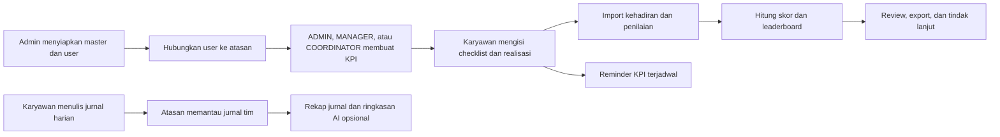
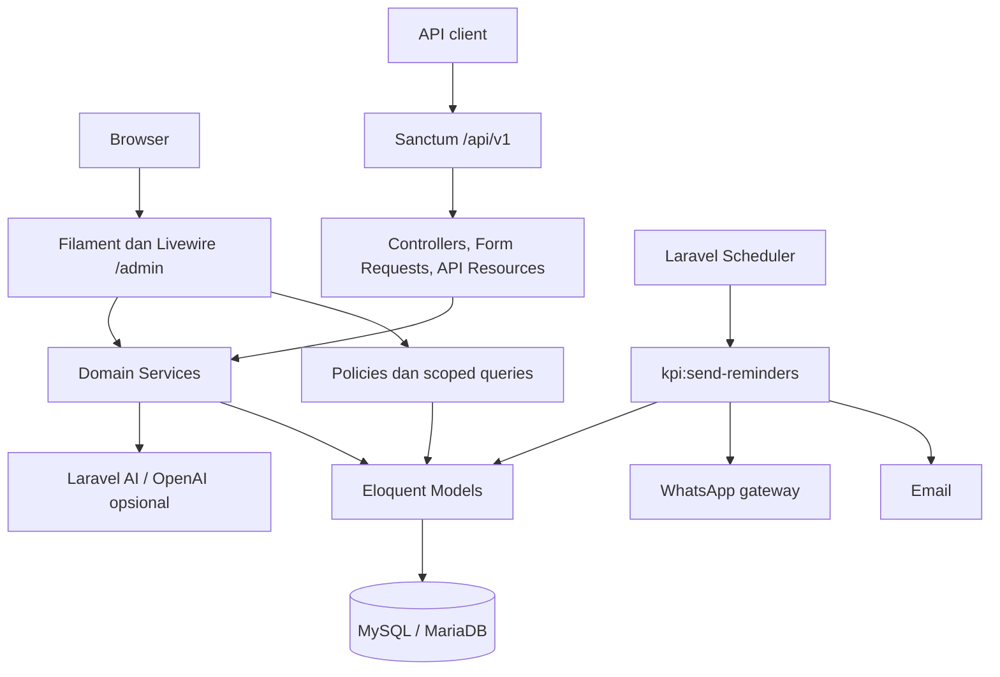

<p align="center">
  
</p>

<h1 align="center">DnD Web</h1>

<p align="center">
  Aplikasi internal untuk mengelola struktur karyawan, KPI bulanan, aktivitas kerja,
  kehadiran, penilaian, jurnal harian, approval, leaderboard, dan reminder.
</p>

DnD menyediakan dua jalur penggunaan:

- **Admin panel Filament** di `/admin` untuk operasional berbasis web.
- **REST API v1** di `/api/v1` untuk integrasi dengan aplikasi lain.

Bahasa utama aplikasi adalah Bahasa Indonesia dan seluruh perhitungan waktu menggunakan zona waktu `Asia/Jakarta`.

> [!IMPORTANT]
> DnD adalah aplikasi internal. API sudah memakai autentikasi Sanctum, tetapi sebagian besar endpoint bisnis belum menerapkan pemeriksaan role dan ownership per objek. Resource Filament umumnya memakai policy dan scoped query, tetapi custom widget, action, import, dan export belum semuanya memiliki guard yang setara. Jangan membuka aplikasi ke klien yang tidak tepercaya sebelum audit authorization selesai.

## Daftar isi

- [Tujuan dan scope](#tujuan-dan-scope)
- [Fitur utama](#fitur-utama)
- [Role, hierarchy, dan hak akses](#role-hierarchy-dan-hak-akses)
- [Cara kerja aplikasi](#cara-kerja-aplikasi)
- [Arsitektur](#arsitektur)
- [Tech stack](#tech-stack)
- [Persiapan development](#persiapan-development)
- [Konfigurasi environment](#konfigurasi-environment)
- [Menjalankan aplikasi](#menjalankan-aplikasi)
- [API dan dokumentasi](#api-dan-dokumentasi)
- [Scheduler dan reminder KPI](#scheduler-dan-reminder-kpi)
- [Workflow development](#workflow-development)
- [Testing dan quality check](#testing-dan-quality-check)
- [Deployment checklist](#deployment-checklist)
- [Batasan dan technical debt](#batasan-dan-technical-debt)
- [Troubleshooting](#troubleshooting)

## Tujuan dan scope

DnD menyatukan proses pengelolaan performa dan pekerjaan karyawan dalam satu sistem. Alur utamanya dimulai dari struktur organisasi dan hubungan atasan, dilanjutkan dengan pembuatan KPI, pengisian realisasi, input kehadiran dan penilaian, lalu ditampilkan sebagai checklist dan leaderboard.

### Termasuk dalam scope

- Master area, divisi, posisi, role, kategori KPI, dan indikator KPI.
- Data karyawan, struktur atasan, arsip pengguna, serta import/export.
- KPI bulanan, target, realisasi, extra task, penilaian, dan penguncian periode.
- Kehadiran bulanan dan penilaian perilaku karyawan.
- Aktivitas terstruktur harian, mingguan, dan bulanan.
- Jurnal kerja harian berbentuk narasi dan rekap per periode.
- Pengajuan tugas dan alur approve/reject.
- Cutpoint, overopen, dashboard, leaderboard, dan laporan.
- Reminder KPI melalui email dan WhatsApp.
- API internal untuk seluruh domain utama.

### Di luar scope implementasi saat ini

- Payroll, reimbursement, saldo cuti, dan proses HRIS penuh.
- Aplikasi mobile atau frontend publik terpisah; repository ini berisi panel Filament dan API backend.
- SSO dan reset password mandiri. Reset password pada halaman login sengaja dinonaktifkan.
- Approval khusus jurnal harian. Jurnal tidak memiliki status `PENDING`, `APPROVED`, atau `REJECTED`.
- File PDF/DOCX native untuk rekap jurnal. Format saat ini dijelaskan pada bagian [Jurnal harian](#4-jurnal-harian).
- Pipeline CI/CD dan environment Docker siap pakai; keduanya belum tersedia di repository.

## Fitur utama

Ketersediaan modul pada setiap surface saat ini:

| Modul | Panel `/admin` | API v1 | Keterangan |
|---|:---:|:---:|---|
| Dashboard KPI dan leaderboard | Ya | Ya | Leaderboard panel terlihat oleh semua user yang dapat masuk panel |
| KPI, checklist, dan extra task | Ya | Sebagian | API memiliki KPI/detail CRUD dan checklist read; roll-up extra task serta lock mutasi hanya ada di panel |
| Kehadiran | Ya | Ya | Data per karyawan dan periode |
| Penilaian karyawan | Ya | Ya | Empat aspek dengan nilai 0–5 |
| Jurnal harian | Ya | Ya | Jurnal pribadi dan pemantauan tim |
| User dan struktur organisasi | Ya | Ya | Role, area, divisi, posisi, dan atasan |
| Import/export | Ya | Sebagian | Excel, JSON karyawan, dan berbagai laporan |
| Reminder email/WhatsApp | Pengaturan | Ya | Eksekusi juga tersedia melalui command scheduler |
| Cutpoint | Ya | Ya | Mengurangi nilai leaderboard web |
| Daily/Weekly/Monthly activity | Tidak | Ya | Fitur API-only saat ini |
| Request approval | Tidak | Ya | Fitur API-only saat ini |
| Overopen | Tidak | Ya | Fitur API-only saat ini |

> [!NOTE]
> **Activity** dan **Work Journal** adalah dua konsep berbeda. Activity menyimpan task terstruktur harian, mingguan, dan bulanan beserta status; log bertingkat saat ini khusus daily activity. Work Journal menyimpan uraian pekerjaan bebas per hari untuk riwayat dan rekap.

## Role, hierarchy, dan hak akses

Role awal dari seeder adalah `ADMIN`, `STAFF`, `TEAM LEADER`, `COORDINATOR`, `MANAGER`, `CHIEF`, dan `BOD`.

### Model hierarchy

- `users.approval_id` menunjuk user yang menjadi atasan/approver.
- Scope yang dikelola atasan terdiri dari **bawahan langsung dan satu tingkat di bawahnya**. Scope tidak dihitung rekursif tanpa batas.
- `roles.requires_approval` menentukan apakah form user wajib meminta atasan.
- `requires_approval` bukan pemberi permission. Hak akses tetap ditentukan oleh policy dan query setiap resource.

### Akses efektif panel web

| Aktor | Akses utama |
|---|---|
| `ADMIN` | Seluruh data, master, konfigurasi, dan jurnal |
| `MANAGER` / `COORDINATOR` | KPI, kehadiran, penilaian, dan daftar/edit user dalam scope; dapat membuat user, dengan guard field/action yang belum ketat |
| Semua user panel | Melihat leaderboard; widget Checklist KPI menawarkan KPI sendiri serta KPI user dalam approval scope jika ada |
| Pemilik jurnal | CRUD jurnal sendiri pada panel web |
| User yang memiliki bawahan | Dapat melihat jurnal tim sesuai scope |

Semua user aktif dapat masuk ke panel Filament. Resource list umumnya dibatasi oleh policy/scoped query, tetapi custom widget, import, export, dan action harus memiliki guard sendiri. Contohnya, mutasi pada widget `ChecklistKPI` saat ini memeriksa deadline tetapi belum memverifikasi ownership/scope ID yang dikirim oleh Livewire. Jangan menganggap pilihan yang tampil di UI sebagai boundary authorization.

Role `TEAM LEADER`, `CHIEF`, dan `BOD` tidak otomatis memperoleh semua akses manajerial hanya karena nama role; periksa implementasi policy dan action sebelum menambah atau mengubah kemampuan role.

Source of truth untuk scope hierarchy adalah [`app/Services/ApprovalScopeService.php`](app/Services/ApprovalScopeService.php). Policy resource web berada di [`app/Policies`](app/Policies); custom widget/action tetap harus diaudit terpisah.

## Cara kerja aplikasi



### 1. Bootstrap organisasi dan user

1. Admin menyiapkan area, divisi, posisi, role, kategori KPI, dan indikator KPI melalui resource master. Nested create di form KPI/User belum seluruhnya mengikuti policy master; lihat technical debt.
2. Admin menentukan role yang membutuhkan atasan melalui `requires_approval`.
3. Setiap user dihubungkan ke atasan melalui `approval_id`.
4. Policy dan scoped query menggunakan hierarchy tersebut untuk membatasi resource panel web; custom action tetap harus melakukan authorization eksplisit.

User dapat dibuat manual, di-import dari Excel, atau disinkronkan dari JSON Talenta melalui panel admin. Import JSON memiliki perilaku khusus:

- User yang sudah ada hanya diperbarui pada email dan nomor HP yang dikirim eksplisit.
- User baru wajib memiliki employee ID, nama, posisi, dan password awal minimal 12 karakter serta maksimal 72 byte. Password hanya diwajibkan unik antar-user baru dalam file import yang sama, bukan terhadap seluruh user di database.
- Role, area, divisi, posisi, approval, dan flag operasional user baru diwarisi dari peer aktif dengan profil posisi/area/divisi yang sama.
- Import ditolak bila profil peer ambigu, supervisor sudah diarsipkan, identifier konflik, atau nomor kontak tidak valid.
- Nomor HP dinormalisasi ke format WhatsApp Indonesia `08...`.

Jalur import JSON yang didukung untuk operasional saat ini adalah panel admin. Lihat keterbatasan endpoint API pada bagian [Batasan dan technical debt](#batasan-dan-technical-debt).

### 2. Siklus KPI

1. Admin memelihara master kategori dan indikator KPI melalui resource khusus.
2. `ADMIN`, `MANAGER`, atau `COORDINATOR` membuat KPI bulanan berdasarkan posisi dan scope user.
3. Bobot seluruh kategori KPI dalam satu paket harus berjumlah 100%.
4. User panel mengisi indikator miliknya atau indikator user yang muncul dalam approval scope melalui Checklist KPI.
5. Pada widget panel, non-admin dapat mengubah checklist sampai akhir bulan ditambah grace period `KPI_CHECKLIST_LOCK_DAYS`.
6. Nilai KPI, kehadiran, review, dan cutpoint dirangkum pada leaderboard web.

Deadline tersebut belum ditegakkan oleh endpoint mutasi KPI API. Widget panel juga belum melakukan authorization ulang terhadap ID objek saat mutasi, sehingga keduanya perlu di-hardening sebelum dianggap sebagai boundary keamanan.

Jenis indikator KPI:

- `NON`: checklist selesai/belum selesai dengan hasil 1 atau 0.
- `RESULT` positif: pencapaian dihitung dari `actual / plan`.
- `RESULT` negatif atau *lower is better*: pencapaian dihitung dari `plan / max(actual, 1)`.
- `Extra Task`: pekerjaan pengganti/child KPI detail yang dapat memperbarui hasil indikator induk. Field ini berbeda dari field teks `subtasks` pada KPI detail.

Baseline perhitungan leaderboard web saat ini:

```text
Skor total = KPI (maks. 70)
           + Kehadiran (maks. 15)
           + Review karyawan (maks. 15)
           - Cutpoint
```

Review karyawan terdiri dari `responsiveness`, `problem_solver`, `helpfulness`, dan `initiative`, masing-masing bernilai 0–5. Rumus KPI bersama berada di [`app/Services/KpiScoringService.php`](app/Services/KpiScoringService.php); implementasi leaderboard web berada di [`app/Filament/Widgets/LeaderboardKPI.php`](app/Filament/Widgets/LeaderboardKPI.php).

Panduan visual tersedia di panel:

- `/admin/panduan-kpi-bawahan` untuk operasional karyawan.
- `/admin/panduan-kpi-atasan` untuk alur manajerial.

### 3. Kehadiran, review, cutpoint, dan overopen

- Kehadiran menyimpan hari kerja, keterlambatan kurang/lebih dari 30 menit, sakit, dan data periode.
- Review menyimpan empat dimensi perilaku yang menjadi komponen 15% penilaian.
- Cutpoint adalah potongan poin manual per periode dan dikurangi dari leaderboard web.
- Overopen adalah counter mingguan yang diisi manual untuk keterlambatan daily, weekly, atau monthly; record-nya tidak berelasi langsung ke record activity. Overopen tidak otomatis menghasilkan cutpoint.
- CRUD dan import kehadiran/review pada panel memakai pembatasan scope.
- Scope export belum seragam: export kehadiran saat ini mengambil seluruh tabel, sedangkan export review untuk non-admin hanya mengambil bawahan langsung. Perlakukan file export sebagai data sensitif sampai guard-nya diseragamkan.

### 4. Jurnal harian

Perilaku berikut adalah aturan pada panel web:

- Satu jurnal aktif per user per tanggal divalidasi pada aplikasi.
- Aktivitas wajib diisi; catatan/kendala bersifat opsional.
- Karyawan dapat melihat, mengubah, dan menghapus jurnal sendiri.
- Atasan dapat melihat jurnal bawahan dalam scope, tetapi tidak mengubah atau menghapusnya.
- Admin dapat melihat dan mengelola seluruh jurnal.
- Tersedia filter karyawan, rentang tanggal, pencarian, export seluruh data, dan export pilihan.
- Aksi **Buat Rekap** merangkum jurnal user yang sedang login pada rentang tanggal tertentu.
- Bila `OPENAI_API_KEY` tersedia, rekap mencoba memakai Laravel AI/OpenAI. Bila tidak tersedia atau request AI gagal, sistem memakai ringkasan lokal.

Opsi “PDF” saat ini menghasilkan halaman HTML siap cetak yang dapat disimpan sebagai PDF dari browser. Opsi Word menghasilkan dokumen HTML-compatible dengan ekstensi `.doc`, bukan `.docx` native.

API jurnal belum menegakkan ownership secara konsisten, dapat menerima `user_id` lain, dan validasi satu jurnal per tanggal dapat terlewati pada jalur tertentu. Jangan mengandalkan aturan panel sebagai jaminan authorization API.

### 5. Request approval

Request API secara normal dibuat dengan status `PENDING` dan approver default dari `approval_id` user yang sedang login, bukan dari user lain yang mungkin dikirim melalui payload. Endpoint approve/reject mencatat status `APPROVED` atau `REJECTED`, user pemroses, dan waktu pemrosesan.

Endpoint tersebut ditujukan untuk approver, tetapi implementasi saat ini belum memastikan pemanggil sama dengan `approval_id`, belum mewajibkan status awal `PENDING`, dan endpoint create masih menerima `user_id`/`approval_id` dari request. Anggap alur ini belum aman untuk client yang tidak tepercaya.

Workflow ini berbeda dari `requires_approval` pada role dan berbeda dari jurnal harian.

### 6. Reminder KPI

Admin dapat membuat aturan untuk:

- `pembuatan_kpi`: mengingatkan atasan bila minimal satu bawahan langsung belum mempunyai record KPI apa pun pada bulan berjalan. Satu record kategori sudah membuat bawahan dianggap “sudah dibuatkan KPI”; command belum memvalidasi kelengkapan seluruh paket/kategori.
- `pengisian_kpi`: mengingatkan karyawan yang masih memiliki indikator KPI belum lengkap.

Target `pembuatan_kpi` ditentukan dari relasi `approval_id`, bukan dari permission pembuat KPI. Akibatnya `TEAM LEADER`, `CHIEF`, atau `BOD` dapat menerima reminder/link meskipun policy saat ini hanya mengizinkan `ADMIN`, `MANAGER`, dan `COORDINATOR` membuat KPI.

Setiap aturan menentukan tanggal tenggat, offset hari pengingat, pengiriman setelah tenggat, channel email/WhatsApp, dan template pesan. Placeholder yang tersedia adalah `{nama}`, `{tenggat}`, `{periode}`, dan `{link}`.

Sistem menggunakan lock dan deduplikasi per aturan, user, channel, dan tanggal agar pengiriman yang sudah berhasil tidak dikirim ulang pada hari yang sama.

## Arsitektur



### Peta source code

| Lokasi | Tanggung jawab |
|---|---|
| `app/Filament/Resources` | CRUD, form, tabel, import/export panel web |
| `app/Filament/Widgets` | Checklist KPI dan leaderboard dashboard |
| `app/Http/Controllers/Api/V1` | Endpoint REST API v1 |
| `app/Http/Requests/Api/V1` | Validasi input API |
| `app/Http/Resources/Api/V1` | Bentuk response JSON API |
| `app/Models` | Model dan relasi Eloquent |
| `app/Policies` | Authorization panel web |
| `app/Services` | Logika domain reusable, scoring, scope, import, dan integrasi |
| `app/Console/Commands` | Reminder dan maintenance KPI |
| `database/migrations` | Evolusi schema database |
| `database/seeders` | Data awal development |
| `routes/api.php` | Seluruh route API v1 |
| `routes/console.php` | Jadwal reminder KPI |
| `tests` | Unit dan feature test |

## Tech stack

| Komponen | Teknologi |
|---|---|
| Backend | PHP >=8.4.1 dan <8.5, Laravel 12 |
| Admin UI | Filament 4, Livewire 3, Mekaya Theme |
| Frontend build | Vite 6, Tailwind CSS 4, Axios |
| Database utama | MySQL/MariaDB |
| API auth | Laravel Sanctum 4 |
| API docs | Dedoc Scramble / OpenAPI |
| Import/export | Laravel Excel dan PhpSpreadsheet |
| AI opsional | Laravel AI dengan provider default OpenAI |
| Test | PHPUnit 11 / Laravel test runner |
| Static analysis | Larastan / PHPStan |

Walaupun `composer.json` masih mendeklarasikan PHP `^8.2`, dependency pada lock file membutuhkan minimal PHP 8.4.1 dan dipasang untuk PHP 8.4.25. Gunakan **PHP 8.4.25** atau PHP 8.4.x minimal 8.4.1. Jangan gunakan PHP 8.5 karena versi PhpSpreadsheet yang terkunci belum kompatibel.

## Persiapan development

### Prasyarat

- Git.
- PHP 8.4.x minimal 8.4.1; PHP 8.4.25 direkomendasikan agar sesuai lock file.
- Composer 2.
- Node.js 24 LTS direkomendasikan; Node.js 22 LTS masih didukung. Jangan memakai Node.js 20 yang sudah EOL.
- MySQL 8+ atau MariaDB yang kompatibel.
- Extension PHP: `curl`, `dom`, `fileinfo`, `gd`, `iconv`, `intl`, `mbstring`, `openssl`, `pdo_mysql`, `simplexml`, `xml`, `xmlreader`, `xmlwriter`, dan `zip`.
- Database dump development yang sudah disanitasi dari tim untuk onboarding saat ini.

SMTP, WhatsApp gateway, dan OpenAI bersifat opsional untuk development dasar.

### Clone dan dependency

```bash
git clone https://github.com/oceanspacedev/dnd-web.git
cd dnd-web
git switch dev-azka

composer install
cp .env.example .env
php artisan key:generate
npm ci
```

Jangan menjalankan `composer update` hanya untuk setup. Dependency Mekaya memakai constraint `@dev`, sedangkan `composer.lock` mengunci commit yang sudah diuji oleh proyek.

### Konfigurasi database

Buat database lokal dan isi koneksinya di `.env`:

```dotenv
APP_NAME=DnD
APP_ENV=local
APP_DEBUG=true
APP_URL=http://127.0.0.1:8000

DB_CONNECTION=mysql
DB_HOST=127.0.0.1
DB_PORT=3306
DB_DATABASE=dnd
DB_USERNAME=root
DB_PASSWORD=
```

#### Jalur onboarding yang didukung saat ini

Fresh migration masih memiliki blocker kompatibilitas pada migration legacy. Untuk onboarding sekarang:

1. Minta database dump development yang sudah disanitasi dari maintainer. Dump harus menyertakan tabel `migrations` yang konsisten dan menandai migration legacy sebagai sudah dijalankan; catat tanggal snapshot serta commit/tag acuannya.
2. Restore dump ke database lokal `dnd`.
3. Pastikan `.env` menunjuk hanya ke database lokal tersebut.
4. Periksa ledger dengan `php artisan migrate:status`. Hentikan proses bila migration task category legacy masih berstatus `Pending`.
5. Jalankan migration yang belum diterapkan.

```bash
mysql -u root -p dnd < /path/to/dnd-development.sql
php artisan migrate:status
php artisan migrate
php artisan storage:link
```

> [!WARNING]
> Jangan menjalankan `php artisan migrate:fresh`, `migrate:refresh`, atau `db:wipe` pada database yang berisi data. Perintah tersebut menghapus tabel/data.

#### Status fresh install

`php artisan migrate --seed` pada database benar-benar baru saat ini berhenti di `2023_06_03_111111_create_task_categories_table.php`. Nama class di dalam migration (`CreateTaskCategoryTable`) tidak sesuai dengan nama class yang diturunkan Laravel 12 dari nama file (`CreateTaskCategoriesTable`).

Sebelum fresh onboarding dapat dinyatakan didukung, migration tersebut perlu diperbaiki menjadi anonymous migration atau diselaraskan nama class-nya, kemudian seluruh migration dan seeder perlu diuji ulang. Setelah blocker diperbaiki, command bootstrap yang diharapkan adalah:

```bash
php artisan migrate --seed
```

Seeder membuat data contoh development, termasuk login lokal `admin` / `complete123`. Ganti password itu segera. Seeder belum idempotent, sehingga hanya boleh dijalankan pada database development kosong dan tidak boleh dijalankan berulang atau di production.

## Konfigurasi environment

Jangan commit `.env` atau credential apa pun ke Git.

| Variabel | Wajib | Fungsi |
|---|:---:|---|
| `APP_KEY` | Ya | Kunci enkripsi Laravel; dibuat dengan `php artisan key:generate` |
| `APP_URL` | Ya | Base URL aplikasi dan link pada reminder |
| `DB_*` | Ya | Koneksi database |
| `KPI_CHECKLIST_LOCK_DAYS` | Tidak | Grace period pengisian KPI setelah akhir bulan; default `5` |
| `KPI_CACHE_TTL_*` | Tidak | TTL cache master kategori, deskripsi, dan posisi; default `300` detik |
| `MAIL_*` | Untuk email | SMTP dan identitas pengirim |
| `WA_API_URL` | Untuk WhatsApp | Endpoint gateway WhatsApp |
| `WA_API_KEY` | Untuk WhatsApp | Bearer credential gateway WhatsApp |
| `WA_CONNECT_TIMEOUT` | Tidak | Timeout koneksi gateway; default `5` detik |
| `WA_API_TIMEOUT` | Tidak | Timeout request gateway; default `15` detik |
| `KPI_REMINDER_CACHE_STORE` | Untuk reminder | Store lock command reminder manual maupun terjadwal; default `kpi_reminders` berbasis database |
| `OPENAI_API_KEY` | Tidak | Mengaktifkan ringkasan AI pada rekap jurnal |
| `OPENAI_URL` | Tidak | Endpoint OpenAI-compatible untuk provider OpenAI |
| `API_VERSION` | Tidak | Versi yang tampil pada OpenAPI; default `0.0.1` |
| `SCRAMBLE_DEV_TOOLS` | Tidak | Menyalakan developer tools pada halaman dokumentasi API |

`OPENAI_API_KEY`, `OPENAI_URL`, `API_VERSION`, dan `SCRAMBLE_DEV_TOOLS` belum tercantum di `.env.example`; tambahkan manual hanya bila fitur terkait dipakai dan jangan memasukkan nilainya ke Git.

Untuk local development tanpa SMTP, gunakan:

```dotenv
MAIL_MAILER=log
MAIL_FROM_ADDRESS=dev@example.test
MAIL_FROM_NAME="${APP_NAME}"
```

Repository tidak membawa container Mailhog/Mailpit. Bila memakai SMTP lokal, jalankan servicenya secara terpisah dan sesuaikan `MAIL_HOST` serta `MAIL_PORT`.

AI tidak wajib. Tanpa `OPENAI_API_KEY`, rekap jurnal tetap bekerja dengan generator ringkasan lokal.

## Menjalankan aplikasi

Jalankan backend dan Vite pada terminal terpisah:

```bash
# Terminal 1
php artisan serve
```

```bash
# Terminal 2
npm run dev
```

Buka:

- Aplikasi: `http://127.0.0.1:8000/admin`
- Health check: `http://127.0.0.1:8000/up`
- Dokumentasi API lokal: `http://127.0.0.1:8000/docs/api`

Scheduler tidak wajib untuk menjalankan UI, tetapi harus dijalankan bila sedang mengembangkan reminder:

```bash
php artisan schedule:work
```

Queue default adalah `sync`, sehingga queue worker tidak dibutuhkan. Jangan mengubah `QUEUE_CONNECTION=database` sebelum menambahkan migration tabel `jobs` dan menyiapkan worker.

## API dan dokumentasi

Base URL API:

```text
http://127.0.0.1:8000/api/v1
```

Login adalah satu-satunya endpoint publik. Endpoint lain berada di balik middleware `auth:sanctum`.

```bash
curl --request POST http://127.0.0.1:8000/api/v1/auth/login \
  --header 'Accept: application/json' \
  --header 'Content-Type: application/json' \
  --data '{
    "login": "<username-atau-email>",
    "password": "<password>",
    "device_name": "Local Development"
  }'
```

Gunakan token dari response sebagai bearer token:

```bash
curl http://127.0.0.1:8000/api/v1/auth/me \
  --header 'Accept: application/json' \
  --header 'Authorization: Bearer <token>'
```

Referensi API:

- UI OpenAPI: `/docs/api`
- Spesifikasi JSON: `/docs/api.json`
- Route source: [`routes/api.php`](routes/api.php)
- Postman collection: [`dnd_auth_api_postman_collection.json`](dnd_auth_api_postman_collection.json) — koleksi parsial; metadata lama masih menyebut “Modul 1” dan isinya belum mencakup seluruh route API

Dokumentasi Scramble otomatis dapat diakses pada `APP_ENV=local`. Pada production, route dokumentasi saat ini mengembalikan 403 karena belum ada Gate `viewApiDocs`; konfigurasi akses harus dibuat secara eksplisit jika dokumentasi production memang dibutuhkan.

Untuk melihat daftar endpoint aktual:

```bash
php artisan route:list --path=api/v1
```

Untuk membuat atau menimpa `api.json` di root repository dari route aktual:

```bash
php artisan scramble:export
```

Response API umumnya menggunakan bentuk berikut:

```json
{
  "success": true,
  "message": "Operasi berhasil.",
  "data": {},
  "meta": {}
}
```

Endpoint update menggunakan method `PUT`; saat ini tidak ada route `PATCH`.

## Scheduler dan reminder KPI

Scheduler menjalankan `kpi:send-reminders` setiap hari pukul **08:00 WIB**.

### Verifikasi aman tanpa mengirim pesan

```bash
php artisan kpi:send-reminders --dry-run
```

Untuk menguji satu aturan:

```bash
php artisan kpi:send-reminders --setting-id=<id> --dry-run
```

Hapus `--dry-run` hanya setelah mail, WhatsApp, recipient, template, dan tanggal trigger sudah diverifikasi.

### Production cron

Laravel scheduler harus dipanggil setiap menit:

```cron
* * * * * cd /absolute/path/to/dnd-web && /absolute/path/to/php8.4 artisan schedule:run >> storage/logs/scheduler.log 2>&1
```

Temukan dan verifikasi path binary PHP 8.4 dengan `command -v php` pada server. Pastikan log scheduler dipantau dan dirotasi, atau arahkan stdout/stderr ke sistem logging deployment. Jangan membuang error scheduler tanpa monitoring.

Pada deployment multi-server, `KPI_REMINDER_CACHE_STORE` harus menunjuk cache store bersama yang mendukung atomic lock. Migration repository sudah menyediakan tabel cache khusus untuk default store `kpi_reminders`.

Command operasional lain:

| Command | Fungsi |
|---|---|
| `php artisan kpi:clear-cache` | Menghapus cache KPI; saat ini juga melakukan global cache flush |
| `php artisan kpi:clean-duplicates --dry-run` | Menganalisis duplikasi deskripsi KPI yang digunakan pada 2025 tanpa mengubah data |
| `php artisan optimize:clear` | Menghapus cache config, route, event, dan view Laravel |

Jangan menjalankan `kpi:clean-duplicates` tanpa `--dry-run` sebelum backup dan review hasil, karena mode aktual mengubah relasi serta melakukan soft delete data.

## Workflow development

Konvensi branch repository saat README ini diperbarui:

- `dev-azka`: branch integrasi development aktif.
- `main`: branch tujuan promosi/release setelah review.
- Branch pekerjaan: buat dari `dev-azka` dengan pola `feat/<scope>`, `fix/<scope>`, atau `docs/<scope>`.

### Memulai pekerjaan

```bash
git switch dev-azka
git pull --ff-only origin dev-azka
git switch -c feat/<nama-fitur>
```

Gunakan scope kecil dan satu tujuan per branch. Hindari menggabungkan refactor luas, perubahan schema, dan fitur bisnis yang tidak berkaitan dalam satu PR.

### Lokasi perubahan berdasarkan jenis fitur

| Kebutuhan | Lokasi umum |
|---|---|
| Tambah/ubah tabel | `database/migrations` dan `app/Models` |
| Logika bisnis reusable | `app/Services` |
| Hak akses panel | `app/Policies` dan scoped query Filament |
| Fitur panel web | `app/Filament/Resources`, `Pages`, atau `Widgets` |
| Endpoint API | Controller + FormRequest + API Resource + `routes/api.php` |
| Background operation | `app/Console/Commands` dan `routes/console.php` |
| Import/export | `app/Imports`, `app/Exports`, atau `app/Filament/Exports` |
| Verifikasi | `tests/Unit` atau `tests/Feature` |

### Aturan implementasi

- Jangan mengubah schema melalui migration yang sudah pernah berjalan di shared environment; tambahkan migration baru yang reversible. Compatibility fix metadata/class pada migration legacy hanya boleh dilakukan maintainer, tanpa mengubah schema, lalu diuji pada database fresh dan database existing.
- Gunakan `ApprovalScopeService` untuk hierarchy; jangan membuat ulang query bawahan di banyak tempat.
- Ikuti pipeline canonical `LeaderboardKPI` untuk scoring sampai agregasinya benar-benar disentralisasi. `calculateKpiScore()` menghasilkan rasio berbobot, sehingga normalisasikan ke unit persen sebelum meneruskannya ke `calculateFinalKpiScore()`; jangan membuat formula baru di controller atau export.
- Endpoint API baru wajib memanggil policy/Gate atau melakukan ownership check yang setara.
- Validasi input API ditempatkan pada FormRequest dan response publik dibentuk melalui API Resource.
- Perubahan pada scoring harus diuji pada checklist, leaderboard web, API, dan export.
- Perubahan konfigurasi wajib diikuti update `.env.example` dan README tanpa memasukkan secret.
- Fitur scheduler/integrasi harus memiliki mode dry-run atau fake pada test dan harus idempotent.
- Tambahkan test regresi untuk setiap perbaikan bug.

### Definition of Done

Sebelum membuka PR ke `dev-azka`, pastikan:

- Scope bisnis dan aktor yang boleh mengakses sudah jelas.
- Migration memiliki `up()` dan `down()` yang aman.
- Policy web dan authorization API sudah diperiksa.
- Validasi error dan empty state sudah ditangani.
- Test terkait ditambahkan; test yang runnable dijalankan memakai database test terpisah dan blocker baseline didokumentasikan.
- `npm run build` berhasil bila ada perubahan frontend/Filament asset.
- Dokumentasi API/Postman diperbarui bila kontrak API berubah.
- Tidak ada `.env`, token, dump database, data pribadi, atau credential di commit.

## Testing dan quality check

> [!CAUTION]
> `phpunit.xml` saat ini tidak mengganti koneksi database. Menjalankan test tanpa `.env.testing` terpisah dapat menyentuh database dari `.env`. Jangan pernah menjalankan test terhadap database development bersama atau production.

Siapkan database test khusus:

```bash
cp .env.example .env.testing
php artisan key:generate --env=testing
```

> [!WARNING]
> `.env.testing` di-ignore oleh repository. Tetap jangan menyalin `.env` ke file ini atau memakai `git add -f`, karena `.env.testing` dapat berisi credential database atau secret layanan.

Ubah minimal nilai berikut di `.env.testing`:

```dotenv
APP_ENV=testing
DB_CONNECTION=mysql
DB_DATABASE=dnd_test
MAIL_MAILER=array
CACHE_DRIVER=array
QUEUE_CONNECTION=sync
SESSION_DRIVER=array
```

Pastikan `DB_DATABASE` pada `.env.testing` berbeda dari `.env`. Fresh test database juga terdampak blocker migration legacy yang dijelaskan di atas. Karena beberapa test memakai `RefreshDatabase`, **full test suite belum dapat dijalankan dengan aman dan konsisten sampai migration tersebut diperbaiki**; database test yang sudah dimigrasikan tidak menghilangkan blocker ini.

Setelah blocker migration diperbaiki, jalankan test berikut:

```bash
# HANYA untuk dnd_test yang disposable; command ini menghapus seluruh isinya
php artisan migrate:fresh --seed --env=testing

# Semua test
php artisan test

# Test tertentu
php artisan test --filter=NamaTest
```

Quality check yang tidak membutuhkan migration dapat dijalankan sekarang:

```bash
# Static analysis level proyek
vendor/bin/phpstan analyse --no-progress

# Preview refactor otomatis; tidak mengubah file
vendor/bin/rector process --dry-run

# Validasi dependency metadata
composer validate --no-check-publish

# Production frontend bundle
npm run build
```

Baseline test dan static analysis saat ini belum sepenuhnya bersih serta beberapa test masih bergantung pada seed/order. Perlakukan failure existing secara terpisah dari regresi baru, dokumentasikan bukti, dan jangan menurunkan coverage perubahan baru. Config Rector juga masih menargetkan set Laravel 9–11 sehingga hasilnya harus direview manual, bukan langsung diterapkan massal.

## Deployment checklist

Repository belum menyediakan pipeline deployment. Minimum checklist untuk server:

1. Gunakan PHP 8.4 dan jalankan preflight `composer check-platform-reqs --lock --no-dev` sebelum install dependency.
2. Set `APP_ENV=production`, `APP_DEBUG=false`, `APP_URL`, database, mail, WhatsApp, dan secret lain dengan benar.
3. Jadikan folder `public/` sebagai document root web server.
4. Pastikan `storage/` dan `bootstrap/cache/` writable oleh user web server.
5. Pastikan database adalah database existing dengan tabel `migrations` yang konsisten. Deployment ke database baru masih terblokir oleh migration legacy; jangan menjalankan `migrate --force` pada fresh database sampai blocker diperbaiki.
6. Install dan build:

   ```bash
   composer install --no-dev --prefer-dist --optimize-autoloader
   npm ci --include=dev
   npm run build
   php artisan migrate --force
   php artisan storage:link
   php artisan optimize
   php artisan filament:optimize
   ```

   Jalankan `php artisan storage:link` pada first deploy atau verifikasi link yang sudah ada sebelum melewati langkah ini.

7. Pasang cron Laravel scheduler setiap menit dan hubungkan error ke monitoring.
8. Verifikasi `/up`, login panel, asset, export, dan reminder dengan dry-run.
9. Review `config/cors.php`; konfigurasi saat ini mengizinkan origin `*`.
10. Jangan menjalankan seeder data contoh di production.
11. Jangan membuka `/api/v1` ke klien tak tepercaya sebelum authorization audit selesai.

Karena `composer.json` menonaktifkan platform check runtime, `composer check-platform-reqs --lock --no-dev` wajib menjadi release check terpisah.

## Batasan dan technical debt

Daftar ini adalah batas perilaku aktual, bukan fitur yang dijanjikan:

1. **Fresh migration belum berjalan.** Ada mismatch nama class pada migration task category legacy.
2. **Authorization API belum setara dengan panel.** Mayoritas controller API hanya bergantung pada token Sanctum. Mutasi jurnal, request approval, KPI, dan domain lain belum konsisten memanggil policy/ownership check; request approval juga belum memverifikasi assigned approver atau transisi dari `PENDING`.
3. **Guard custom panel belum seragam.** Widget `ChecklistKPI` belum meng-authorize ID objek ketika mutasi. Form user memungkinkan `MANAGER`/`COORDINATOR` membuat user atau mengubah bawahan ke role berprivilege termasuk `ADMIN`; import Excel dapat memperbarui/restore user secara luas dan membuat master organisasi. Nested create pada form KPI/User juga dapat membuat indikator/posisi tanpa mengikuti policy resource master. UI visibility bukan pengganti authorization action.
4. **Scoring belum memiliki satu implementasi lintas surface.** Dashboard web, beberapa endpoint API, dan export masih memiliki perbedaan formula, unit, dan grade; cutpoint juga belum selalu dikurangi di API/export. Jadikan pipeline `LeaderboardKPI` sebagai baseline perilaku saat ini sambil memusatkan agregasi ke service.
5. **API KPI hanya mendukung sebagian workflow.** API belum membuat relasi `parent_id` untuk roll-up extra task dan belum menegakkan lock periode pada endpoint mutasi.
6. **API import JSON belum menjadi jalur operasional.** `UserController::importJson()` masih memanggil method service yang tidak tersedia. Gunakan import JSON dari panel admin sampai diperbaiki dan diberi authorization.
7. **Scope export belum konsisten.** Export kehadiran mengambil seluruh tabel, sedangkan export review non-admin hanya mengambil bawahan langsung, bukan seluruh approval scope. Audit sebagai potensi kebocoran data.
8. **Constraint keunikan sebagian masih di application layer.** Contohnya jurnal per user/tanggal dan sejumlah data per user/periode belum semuanya memakai unique constraint database.
9. **Format rekap jurnal bukan file office native.** “PDF” adalah printable HTML dan Word adalah HTML-compatible `.doc`.
10. **Ada rule legacy berbasis ID/username.** Beberapa policy dan master KPI masih bergantung pada ID atau username tertentu. Jangan mengurutkan ulang seed/master ID tanpa audit.
11. **Role tidak otomatis berarti permission.** Beberapa role organisasi belum dipetakan ke kemampuan manajerial pada policy.
12. **Queue dan infra belum dipaketkan.** Default queue adalah `sync`; tidak ada migration tabel `jobs`, Docker setup, atau CI pipeline.
13. **API docs production belum dikonfigurasi.** Scramble membatasi docs di luar environment local sampai Gate akses dibuat.
14. **Filter reminder API sebagian rusak.** Filter `periode` dan `search` pada reminder log merujuk kolom yang tidak ada (`periode`/`destination`; schema memakai `sent_at`/`recipient`) sehingga request berfilter dapat gagal.
15. **Contoh environment belum lengkap.** `.env.example` belum memuat seluruh variabel OpenAI dan Scramble yang didokumentasikan di atas.
16. **Target reminder belum diselaraskan dengan permission.** Reminder pembuatan KPI dapat dikirim kepada user yang menjadi approver tetapi tidak diizinkan oleh `KpiPolicy` untuk membuat KPI.

Gunakan bagian ini sebagai checklist pertama ketika mengerjakan hardening dan onboarding teknis.

## Troubleshooting

### Composer menolak versi PHP

Pastikan CLI dan FPM sama-sama memakai PHP 8.4:

```bash
php -v
composer check-platform-reqs
```

PHP 8.5 belum didukung oleh PhpSpreadsheet yang terkunci.

### Composer melaporkan `ext-intl` atau `ext-iconv` tidak tersedia

Install/aktifkan extension yang hilang untuk PHP 8.4, lalu ulangi `composer install`. Jangan memakai `--ignore-platform-reqs` sebagai solusi environment normal.

### `Vite manifest not found`

```bash
npm ci
npm run build
php artisan optimize:clear
```

### Perubahan config atau route tidak terbaca

```bash
php artisan optimize:clear
```

### `/docs/api` mengembalikan 403

Pastikan development memakai `APP_ENV=local`. Untuk production, buat Gate `viewApiDocs` sebelum membuka dokumentasi.

### Reminder tidak terkirim

1. Jalankan `php artisan kpi:send-reminders --dry-run`.
2. Periksa rule aktif, tanggal tenggat, offset hari, dan tipe reminder.
3. Periksa email/nomor HP user.
4. Periksa `MAIL_*`, `WA_API_URL`, dan `WA_API_KEY`.
5. Periksa `storage/logs/laravel.log` dan tabel log reminder.
6. Pastikan scheduler aktif dan `APP_URL` menghasilkan link yang benar.

### Rekap jurnal tidak memakai AI

Pastikan `OPENAI_API_KEY` valid dan config cache sudah dibersihkan. Tanpa key atau saat provider gagal, fallback lokal memang digunakan dan proses rekap tetap dilanjutkan.

---

README ini mendokumentasikan perilaku pada branch `dev-azka`. Bila implementasi, formula, authorization, atau alur deployment berubah, perbarui README pada PR yang sama.
